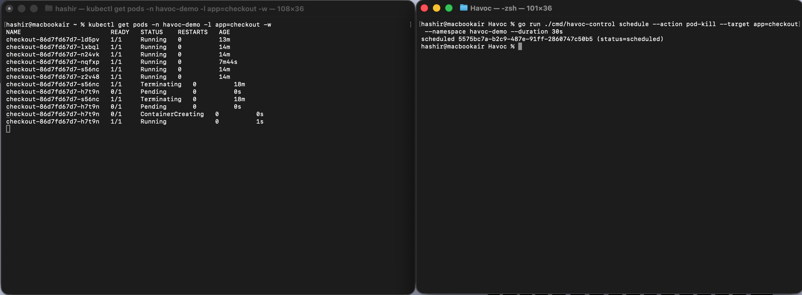

# Havoc

A controlled chaos engineering platform for Kubernetes. Havoc schedules experiments, kill a pod, inject latency, burn CPU, and executes them through lightweight agents running on every cluster node, behind hard safety guardrails that prevent an experiment from escaping its intended blast radius. Every experiment is recorded in an auditable, searchable history.

This is a portfolio project. It is production-shaped, not production-sized: a working end-to-end demo of a distributed command-and-control architecture, runnable locally on `kind` and deployable to a real EKS cluster from the same Helm chart.



## Architecture

Three Go binaries, one module, one repository.

```
  CLI ─▶  Control Plane ─▶  Kafka (havoc.commands)  ─▶  Agents (DaemonSet)
                │                                             │
                ▼                                             ▼
         Postgres + Redis                          Kafka (havoc.results)
                                                              │
                                                              ▼
                                                          Recorder
                                                              │
                                                              ▼
                                                  Postgres + Redis + ELK
```

### Components

| Binary           | Role                                                                                  |
| ---------------- | ------------------------------------------------------------------------------------- |
| `havoc-control`  | HTTP API + CLI. Validates experiments, enforces guardrails, publishes commands.       |
| `havoc-agent`    | DaemonSet. Consumes commands, executes chaos actions on its node, publishes results. |
| `havoc-recorder` | Kafka consumer. Writes results to Postgres, clears Redis locks, emits structured logs. |

All three binaries expose a `/healthz` (liveness) and `/readyz` (readiness) HTTP endpoint. Readiness flips to 200 only after every dependency — Kafka, Postgres, Redis, the Kubernetes API — has been dialed successfully, so half-initialized pods are kept out of service rotations.

## Chaos Actions

Three, deliberately.

- **Pod Kill** — deletes a randomly-selected pod matching a label selector.
- **Network Latency** — injects `tc`-based outbound latency inside the target pod's network namespace.
- **CPU Pressure** — runs a CPU-burn routine inside the target pod for a defined duration.

## Safety Guardrails

- **Blast radius limit.** Every experiment declares a label selector. The control plane rejects it if the experiment would affect more than N% of matching pods (default 25%).
- **Active-experiment lock.** A Redis key `havoc:active:{service}` blocks stacking two experiments on the same service. Released by the recorder once a result lands.
- **Global kill switch.** A single Redis key `havoc:killswitch` that every agent polls during long-running actions. `havoc-control stop-all` sets it; in-flight experiments cancel cleanly and publish an `aborted` result.
- **Blackout windows.** Config rows in Postgres describing time ranges during which experiments are rejected (e.g. business hours, deployment freezes).

## Tech Stack

Go · Apache Kafka (Strimzi on EKS / Confluent on local) · PostgreSQL · Redis · ELK · Kubernetes (Amazon EKS + `kind`) · Terraform · Helm · Docker · GitLab CI/CD

## Repository Layout

```
havoc/
├── cmd/
│   ├── havoc-control/        # API server + CLI
│   ├── havoc-agent/          # DaemonSet binary
│   └── havoc-recorder/       # Kafka consumer → Postgres
├── internal/
│   ├── domain/               # experiment types + validation
│   ├── chaos/                # pod_kill, network_latency, cpu_pressure
│   ├── safety/               # blast radius, locks, kill switch, blackouts
│   ├── agent/                # per-node command runner
│   ├── recorder/             # result-stream consumer
│   ├── kafka/                # producer + consumer wrappers
│   ├── postgres/             # queries + embedded migrations
│   ├── redis/                # kill switch + lock helpers
│   ├── k8s/                  # cluster client + SPDY exec
│   ├── api/                  # HTTP types shared between control plane and CLI
│   ├── health/               # /healthz + /readyz HTTP server
│   └── config/               # env-driven config loaders
├── deploy/
│   ├── docker-compose.yml    # local infra: Kafka, Postgres, Redis, ELK
│   ├── Dockerfile            # multi-stage, parameterised by --build-arg BIN
│   ├── kind/                 # kind cluster config (joins the compose network)
│   ├── k8s/                  # raw manifests (Phase 5; superseded by Helm for AWS)
│   ├── strimzi/              # Strimzi Kafka cluster + topic CRs for EKS
│   └── bootstrap/            # local Kafka topic creation
├── charts/
│   ├── havoc/                # control + agent + recorder + filebeat
│   └── havoc-demo/           # 4-replica checkout workload to attack
├── terraform/                # AWS: VPC, EKS, RDS, ElastiCache, ECR, IRSA, EBS CSI
├── docs/screenshots/         # demo evidence (local kind + AWS EKS)
└── Makefile                  # every workflow has a target — `make help` lists them
```

## Getting Started

The same Makefile drives every step. `make help` prints all targets; the prose below names the path.

### Prerequisites

- Docker Desktop (or any Docker daemon)
- `kind` (Kubernetes-in-Docker)
- `kubectl`
- `helm` (3.x)
- Go 1.24+
- The `havoc-control` CLI is invoked via `go run ./cmd/havoc-control`, so no separate install is needed.

### Local stack (kind + docker-compose)

The local development environment runs Kafka, Postgres, Redis, and ELK in `docker-compose`, plus a 3-node `kind` cluster joined to the same Docker network so pods inside `kind` can reach `kafka:29092` and friends by service name.

**Bring up the full stack and run the smoke test:**

```sh
make all-up    # docker-compose up + kafka topic bootstrap + kind cluster + image build + load + kubectl apply
make demo      # schedule a pod_kill experiment against the checkout demo workload
make logs-agent
```

In another terminal you'll see the targeted pod transition `Running → Terminating → Pending → Running` as the Deployment self-heals.

**Try the other two actions:**

```sh
make demo-cpu      # 30s CPU pressure at 80%
make demo-latency  # 30s of 200ms outbound latency
```

**Inspect state:**

```sh
make psql      # opens psql against the local Postgres
make kibana    # opens Kibana — search by experiment_id to trace one experiment across all components
```

**Tear it all down:**

```sh
make all-down    # uninstall + kind delete + docker-compose down (keeps volumes)
make nuke        # like all-down but also drops the docker-compose volumes
```

The Helm path (parallel to the raw-manifest path above) lives behind `make local-up && make helm-up && make helm-down`. See [deploy/README.md](deploy/README.md) for the rationale on the dual setup and the kind ↔ docker-compose networking trick.

### AWS EKS deployment

Provisioned with Terraform, deployed with Helm. Tier sizing is the smallest viable for a portfolio demo (~$0.19/hr while the cluster is up).

```sh
make aws-init                              # terraform init (one-time)
make aws-plan                              # review the plan
make aws-up                                # provision EKS, RDS, ElastiCache, ECR, IRSA
aws eks update-kubeconfig --region us-east-1 --name havoc-eks
helm install strimzi-kafka-operator strimzi/strimzi-kafka-operator -n kafka --create-namespace
kubectl apply -f deploy/strimzi/kafka.yaml
make ecr-push                              # cross-build linux/amd64 and push 3 images
make aws-secrets                           # create havoc-secrets from terraform outputs
helm upgrade --install havoc charts/havoc -n havoc -f charts/havoc/values.yaml -f charts/havoc/aws.values.yaml
helm upgrade --install havoc-demo charts/havoc-demo -n havoc-demo --create-namespace
kubectl -n havoc port-forward svc/havoc-control 8080:8080 &
make demo                                  # same end-to-end flow as locally
make aws-down                              # tear it all down — run this at the end of every session
```

Demo evidence (live experiments, end-to-end, on a real EKS cluster) lives in [docs/screenshots/](docs/screenshots/).

## Status

Core architecture implemented. Chaos actions, guardrails, and recorder functional. EKS deployment in progress.

| Area                                                   | State |
| ------------------------------------------------------ | ----- |
| Domain types, blast-radius validation                  | done  |
| Three chaos actions (pod_kill, cpu_pressure, latency)  | done  |
| Safety guardrails (locks, kill switch, blackouts)      | done  |
| Agent runner with Kafka consumer-group self-filter     | done  |
| Recorder pipeline with idempotent result writes        | done  |
| Local stack: docker-compose + kind + ELK               | done  |
| Helm charts (control, agent, recorder, demo, filebeat) | done  |
| AWS infrastructure: VPC, EKS, RDS, ElastiCache, ECR    | done  |
| Strimzi Kafka on EKS                                   | done  |
| End-to-end pod_kill on EKS                             | done  |
| GitLab CI/CD pipeline                                  | next  |

## License

MIT. See [LICENSE](LICENSE).
